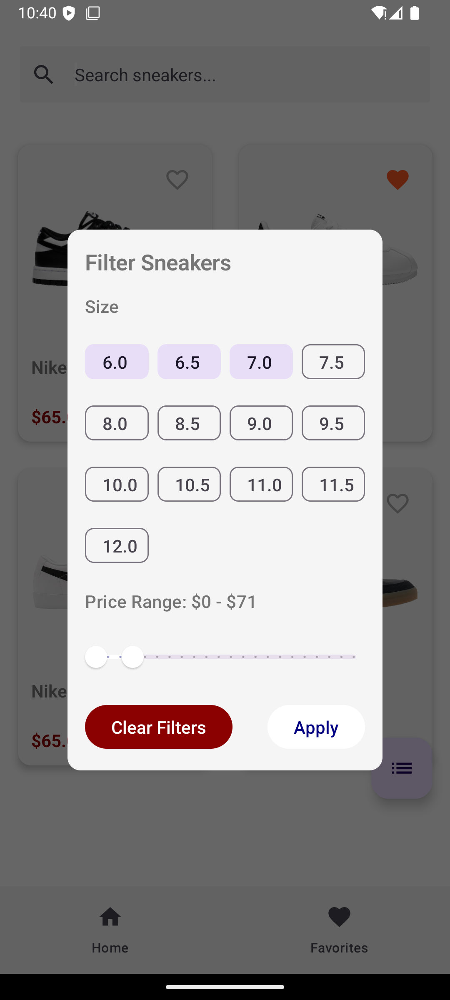

# SneakerApp

A modern Android application built entirely in Kotlin, showcasing a collection of Nike sneakers. The app demonstrates modern Android development practices using MVVM architecture, Jetpack Compose for UI, Room for local storage, and Hilt for dependency injection. It features a responsive Material 3 design with smooth animations, reactive state management using Kotlin Flows, and a clean architecture pattern.

The app allows users to browse sneakers in a grid layout, search by name, filter by price range and sizes, view detailed product information, and maintain a favorites list persisted in local storage. Navigation is handled by Jetpack Navigation Compose, while image loading is managed efficiently by Coil. The entire UI is built using declarative patterns with Jetpack Compose, offering a smooth and responsive user experience.

## Features

- Browse sneakers in a responsive grid layout
- Search sneakers by name
- Filter sneakers by:
  - Price range
  - Available sizes
- View detailed sneaker information
- Add/remove sneakers to/from favorites
- Smooth animations and transitions
- Material 3 design implementation

## Tech Stack

### Language & Platform
- **Kotlin**: 100% Kotlin codebase
- **Kotlin DSL**: Gradle build configuration
- **Kotlin Coroutines**: For asynchronous programming
- **Kotlin Flow**: For reactive streams

### UI
- **Jetpack Compose**: Modern declarative UI toolkit
- **Material 3**: Latest Material Design implementation
- **Coil**: Image loading library optimized for Compose
- **Custom Animations**: Using Compose animation APIs

### Architecture
- **MVVM Architecture**: Clean separation of concerns
- **Repository Pattern**: Single source of truth for data
- **Dependency Injection**: Using Hilt
- **ViewModel**: Managing UI state and business logic

### Navigation
- **Jetpack Navigation Compose**: Handling in-app navigation
- **Type-safe arguments**: For passing data between screens

### Storage
- **Room Database**: Local storage for favorites
- **Flow**: Reactive data streams
- **StateFlow**: UI state management

### Other Libraries & Tools
- **Hilt**: Dependency injection
- **ViewModels**: State management and data persistence
- **Material Icons**: Icon resources

## Architecture

The app follows the MVVM (Model-View-ViewModel) architecture pattern and is organized into the following layers:

- **UI Layer**: Compose UI components
- **ViewModel Layer**: Business logic and state management
- **Repository Layer**: Data operations abstraction
- **Data Layer**: Local storage with Room

## Screenshots

## Getting Started

1. Clone the repository
2. Open the project in Android Studio (Electric Eel or newer)
3. Make sure you have the Kotlin plugin installed and updated
4. Build and run the app

## Requirements

- Android Studio Electric Eel or newer
- Kotlin plugin 1.8.0 or newer
- Minimum SDK: 21
- Target SDK: 34